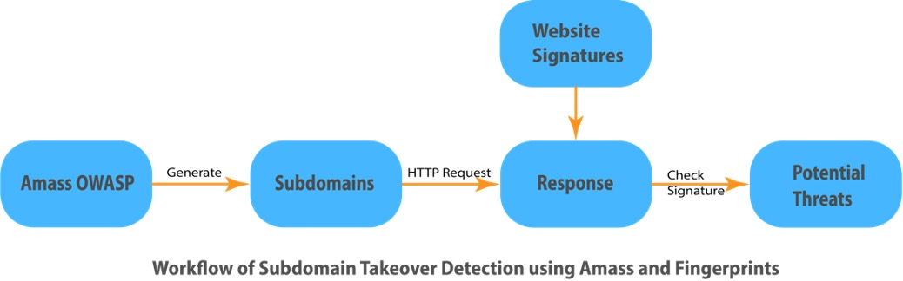

# Malicious Subdomains Detection using Amass and Fingerprints
This project is the final project of ***CSE 548: Advandced Computer Network Security***.

In this project, we are trying to identify some subdomains that could post some threats in future.

## Description
Subdomains are domains that derived from the root domains. Those are created to help organizations and companies to navigate to different sections of the root domain. For example, `mywebsite.com` is the root domain, and `example.mywebsite.com` is the subdomain of `mywebsite.com`. 

The basic idea behind subdomain takeover is a process that attackers are trying to gain control and put his own malicious contents on the vulnerable subdomain, when the subdomain is pointing to a third-party service and the name was not registered.

Subdomains like these could post some potential threats, like hosting a phishing website, defacing websites, and privacy leakage. To be specific, once successfully takeover a subdomain, attackers can redirect traffic which are for a legit organization’ domain to the site that the attacker has full control. 

In this project, we are using Amass to scan all subdomains related to a root domain, and trying to find out if there is any potential takeover threat to the subdomain.

## Project Design

## Run
1. Download amass (refer to [installtion guide](https://github.com/OWASP/Amass/blob/master/doc/install.md) for more)
> snap install amass

2. Download prerequisite
> pip install -r requirements.txt

3. Simply run `main.py` with the root domain
> python3 main.py --root_domain example.com  

Then a `example.txt` file will be generated which contains all subodmains that amass found, `example.txt.json` file will also be generated which contains the results.

4. Check basic statistics
> python3 main.py --root_domain paypal.com --count_stat True

It will return the following results  
> Root domain: paypal.com  
> Number of subdomains: 4515  
> Number of failed connection: 4340  
> Number of successful connection: 175  
> Number of detected vulnerability: 0  
> Number of real timeout: 0  
> Number of too many redirects: 0  
 
## Reference
[How to Use OWASP Amass: An Extensive Tutorial](https://www.dionach.com/en-us/blog/how-to-use-owasp-amass-an-extensive-tutorial/)

[Error Signatures](https://github.com/ArifulProtik/sub-domain-takeover/blob/master/subdomain.py#L7:#L61)

[amass — Automated Attack Surface Mapping](https://danielmiessler.com/study/amass/)

[A Guide to Subdomain Takeovers](https://www.hackerone.com/application-security/guide-subdomain-takeovers)